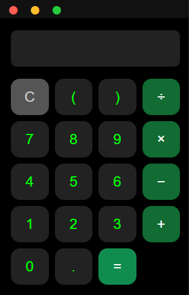

# 📟 Calculadora Desktop (Windows Forms)

  
  
  
  
  

  Uma calculadora de operações básicas, construída como aplicativo desktop usando Python com interface gráfica baseada em HTML, CSS e JavaScript. ( Fiz no Tédio ent Pode Estar Bugada )

---

## ⚙️ Tecnologias Utilizadas

- 🐍 **Python 3.12+**
- 💻 **Windows Forms** ( via `pywebview` )
- 🌐 **HTML5 / CSS3 / JavaScript** ( interface )
- 📦 `pip`, `virtualenv`, etc.

---

## ✨ Funcionalidades

- ✅ Operações matemáticas básicas: soma, subtração, multiplicação e divisão
- ✅ Interface moderna e responsiva
- ✅ Funciona como app nativo no Windows
- ✅ Separação de lógica backend (Python) e frontend (JavaScript)

---

## 🧪 Captura de Tela

  

---

## 🖥️ Como Executar

### Pré-requisitos

- Python 3.12 ou superior
- Pip instalado
- Ter Força de vontade
- Ter Paciencia Com os Erro que da Nesse Bagulho

### Passos para rodar o projeto:
- abrir o exe que ta na pasta `App` seu burro
- Não Encher meu Saco no Discord Dizendo Que é Virus ( SENDO QUE É OPEN SOURCE ESSA PHA )
- --------------- Powered By DS Software ---------------
